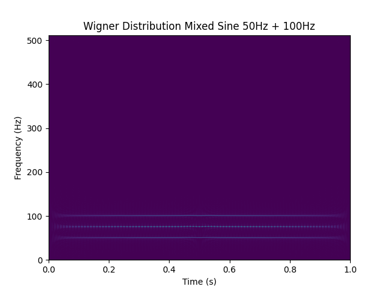
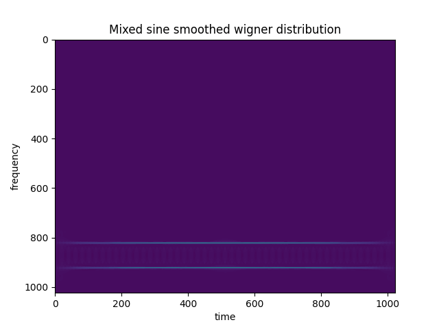

# The Wigner Distribution

The Wigner distribution, often also Wigner-Ville distribution, is a time-frequency distribution, like the spectrogram, with very interesting properties and a high resolution in both the time and frequency domains. It has the benefits of ideal resolution properties [1] but it also includes signal-dependent interference terms [1] which are mathematical attributes but do not represent pure signal terms.

In certain cases like Quantum state state analysis these interference terms are very informative. In real world time-frequency signal analysis these interference terms may make interpretation of present signals difficult. For this reason, many interference reduction algorithms have been designed. This repository aims to implement both the Wigner distribution and a way to reduce interference terms without disturbing auto terms (actually present signals). A method for interference reduction based on [2] is also provided. Note that applying interference reduction destroys certain mathematical properties of the Wigner distribution.


Here we see the Wigner distribution of a pure sine wave at 50Hz. It has great resolution in both the time and frequency domain. The fringes at either end of the time domain are computational artifacts.



Here we see the Wigner distribution of two sine waves, one at 50Hz and one at 100Hz. Right in the middle (at 75Hz) we see an interference pattern with positive and negative values. The signals at 50Hz and 100Hz from are called autoterms (these are present in the input signal), and the interference terms should be ignored when looking at time-frequency analysis of real signals.


The same signal as the last image was passed into the interference reduced Wigner-distribution. The interference terms are removed and autoterms are maintained with minimal resolution loss.


## An Efficient Implementation

This repository aims to implement an efficient implementation of the algorithm defined by Claasen and Mecklenbräuker [1] using numpy and scipy.

## The goal of this repository

Matlab has a built in Wigner distribution function, I believe that Python standard libraries should include the Wigner distribution too. I'm planning on eventually opening a pull request for scipy. 

# Installation

Simply download this repository. It depends only on standard python libraries including:
+ numpy
+ scipy
+ matplotlib

Matplotlib is, probably as expected, only required for visualization purposes used in some of the tests. This repository is coded for Python3, Python2 support is not guaranteed.

To install this module, clone this repository, open a terminal and go to the root directory of this repository. Then run `pip install .` or `pip install -e .` for development.

# Tests

Tests can be run in the following way:
1. Open a terminal and move to the root directory of this repository
2. Enter `$ python3 -m tests.<test_to_be_run>` and press return.
For instance, run:
```shell
$ python3 -m tests.sine_wave_wigner_distribution
```
To run the `tests/sine_wave_wigner_distrubtion.py` script.

# License

This Software is distributed under the MIT License

# References

[1] T. Claasen, W. Mecklenbräuker, The Wigner Distribution -- A Tool For 
Time-Frequency Signal Analysis, Phillips J. Res. 35, 276-300, 1980

[2] Pikula, Stanislav & Beneš, Petr. (2020). A New Method for Interference Reduction in the Smoothed Pseudo Wigner-Ville Distribution. International Journal on Smart Sensing and Intelligent Systems. 7. 1-5. 10.21307/ijssis-2019-101. 
